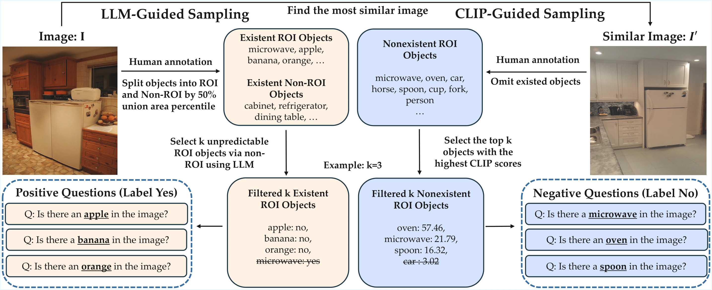

# ORIC: Benchmarking Object Recognition under Contextual Incongruity in Large Vision-Language Models

This repo provides the source code & data of our paper: [**ORIC: Benchmarking Object Recognition in Incongruous Context for Large Vision-Language Models**](https://arxiv.org/abs/2509.15695) by

**Authors:**  
[Zhaoyang Li](https://zhaoyangli-1.github.io/)\* (UC San Diego), [Zhang Ling](https://lz1oceani.github.io/)\* (UC San Diego), [Yuchen Zhou](https://www.yuchenzhou.org/) (UC San Diego), [Litian Gong](https://gonglitian.github.io/) (UC Riverside), [Erdem Bıyık](https://ebiyik.github.io/) (University of Southern California), [Hao Su](https://cseweb.ucsd.edu/~haosu) (UC San Diego, Hillbot)  

\* Equal contribution.





## 1. Setup:
```bash
https://github.com/ZhaoyangLi-1/ORIC.git
cd ORIC
conda create -n ORIC python=3.10
conda activate ORIC
bash setup.sh
```

## 2. Set your OpenAI API Key:
```bash
export OPENAI_API_KEY="your_openai_api_key"
```

## 3. Generate ORIC QA Samples:
```bash
python main.py \
  --data_folder /path/to/coco \
  --output_folder /path/to/output \
  --num_objects 3 \
  --num_images 1000 \
  --seed 42 \
  --llm_model gpt-4o-2024-08-06 \
  --reject_prompt ./prompts/reject_sample.txt \
  --split val
```

Arguments:

--data_folder: Path to your COCO dataset folder.

--output_folder: Directory to save generated Q&A samples.

--num_objects: Number of objects to sample per image.

--num_images: Number of image pairs to use. The total number of Q&A pairs ≈ 2 × num_images × num_objects.

--llm_model: OpenAI model name (e.g., gpt-4o-2024-08-06).

--reject_prompt: Prompt template used to formulate questions.

--split: Dataset split to use: `train` or `val`.  
- `train`: generates ORIC-style training data  
- `val`: generates ORIC-Bench evaluation data


This step produces ORIC-style Q&A pairs ready for inference. We already provide generated questions in the outputs folder for dirrectly using.


## 4. Run Inference with Your VLM:

Run your Vision-Language Model (VLM) on the generated ORIC Q&A pairs. The output should be saved in a JSON file with the following structure:

```json
[
  {
    "question_id": "000001",
    "predicted_answer": "yes",
    "label": "yes"
  },
  {
    "question_id": "000002",
    "predicted_answer": "no",
    "label": "no"
  }
]
```

## 5. Evaluate Model Performance：
```bash
python evaluate.py \
  --result_path /path/to/predictions.json \
  --output_folder /path/to/eval_results
```
