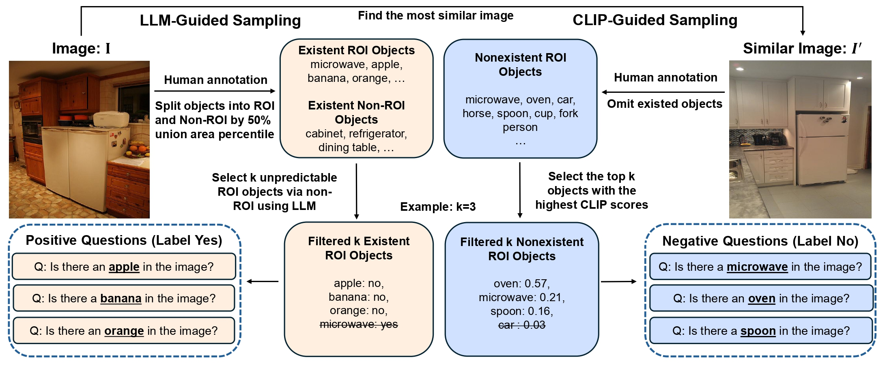

# ORIC: Benchmarking Object Recognition under Contextual Incongruity in Large Vision-Language Models

This repository provides the official implementation and data for  
[**ORIC: Benchmarking Object Recognition in Incongruous Context for Large Vision-Language Models**](https://arxiv.org/abs/2509.15695)

[Zhaoyang Li](https://zhaoyangli-1.github.io/)\* (UC San Diego), [Zhang Ling](https://lz1oceani.github.io/)\* (UC San Diego), [Yuchen Zhou](https://www.yuchenzhou.org/) (UC San Diego), [Litian Gong](https://gonglitian.github.io/) (UC Riverside), [Erdem Bıyık](https://ebiyik.github.io/) (University of Southern California), [Hao Su](https://cseweb.ucsd.edu/~haosu) (UC San Diego, Hillbot)  

\* Equal contribution.

---



We **ORIC** is a framework designed to systematically evaluate object recognition under such **incongruous contexts**, where objects appear in unexpected contexts, or expected objects fail to appear. It constructs challenging object–context pairs via two complementary strategies:  

(1) **LLM-guided sampling** to identify hard-to-recognize existing objects, and  
(2) **CLIP-guided sampling** to mine plausible but absent ones.  

Applied to MSCOCO, ORIC produces both **ORIC-Bench** (evaluation) and **ORIC-style training data**. We provide codes for both evaluation of the ORIC-Bench and fine-tuning Qwen3-VL-8B-Instruct with **Visual Reinforcement Fine-Tuning (Visual-RFT)**. Overall, ORIC highlights contextual incongruity as a key source of uncertainty in LVLMs and provides tools for developing more reliable vision-language systems.

---


## 🛠️ 1. Setup:
```bash
git clone https://github.com/ZhaoyangLi-1/ORIC.git
cd ORIC
conda create -n oric python=3.10
conda activate oric
bash setup.sh
```

## 2. Set your OpenAI API Key:
```bash
export OPENAI_API_KEY="your_openai_api_key"
```

## 3. Generate ORIC QA Samples:
```bash
python main.py \
  --data_folder /path/to/coco \
  --output_folder /path/to/output \
  --num_objects 2 \
  --num_images 1000 \
  --seed 42 \
  --llm_model gpt-5-2025-08-07 \
  --reject_prompt ./prompts/reject_sample.txt \
  --split val
```

Arguments:

--data_folder: Path to your COCO dataset folder.

```text
data_folder/
├── train2014/                 # Training images
│     ├── COCO_train2014_000000000009.jpg
│     └── ...
├── val2014/                   # Validation images
│     ├── COCO_val2014_000000000042.jpg
│     └── ...
└── annotations/               # COCO annotation JSON files
      ├── instances_train2014.json
      └── instances_val2014.json
```

--output_folder: Directory to save generated Q&A samples.

--num_objects: Number of objects to sample per image.

--num_images: Number of image pairs to use. The total number of Q&A pairs ≈ 2 × num_images × num_objects.

--llm_model: OpenAI model name (e.g., gpt-5-2025-08-07).

--reject_prompt: Prompt template used to formulate questions.

--split: Dataset split to use: `train` or `val`.  
- `train`: Produces ORIC-style training data.
- `val`: Produces ORIC-Bench evaluation data.


This step produces ORIC-style Q&A pairs ready for inference. We already provide generated questions in the outputs folder for dirrectly using.


## 4. Run Inference with Your VLM:

Run your Vision-Language Model (VLM) on the generated ORIC Q&A pairs. The output should be saved in a JSON file with the following structure:

```json
[
  {
    "question_id": "1",
    "predicted_answer": "yes",
    "solution": "yes"
  },
  {
    "question_id": "2",
    "predicted_answer": "no",
    "solution": "no"
  }
]
```

## 5. Evaluate Model Performance:
```bash
python evaluate.py \
  --result_path /path/to/predictions.json \
  --output_folder /path/to/eval_results
```

## 6. Visual-RFT Finetuning

Visual-RFT is our reinforcement-learning finetuning pipeline built upon Group Relative Policy Optimization (GRPO), designed to reduce uncertainty-driven hallucination and improve robustness under contextual incongruity.

### Requirements
- 4 × NVIDIA H100 / A100 GPUs  
- PyTorch ≥ 2.1  
- Flash-Attention v2  
- DeepSpeed ZeRO-3 (config included in repo)

---

### 6.1 Training Data Preprocessing

Before running Visual-RFT finetuning, ORIC-style training data must be converted into a **HuggingFace Dataset** format.   Use the following preprocessing script to convert an ORIC JSON file into a HF `DatasetDict`:

```bash
python virft/dataset/build_dataset.py \
  --json_path /path/to/oric_train.json \
  --image_dir /path/to/coco/images \
  --save_path /path/to/hf_datase
```

### 6.2 Training Command

Run the following command to launch GRPO fine-tuning on 4 GPUs:

```bash
export DEBUG_MODE="true"
export LOG_PATH="./debug_log_8b_GRPO_oric.txt"

export DATA_PATH=./dataset  ### ORIC-style training data path which was saved in Section 6.1
export CKPT_PATH=./share_models/Qwen3-VL-8B-Instruct ### Qwen3-VL-8B-Instruct checkpoint path
export SAVE_PATH=./share_models/Qwen3-VL-8B-Instruct_GRPO_oric ### save path

torchrun --nproc_per_node="4" \
    --nnodes="1" \
    --node_rank="0" \
    --master_addr="127.0.0.1" \
    --master_port="12345" \
    virft/src/open_r1/grpo_classification.py \
    --output_dir ${SAVE_PATH} \
    --model_name_or_path ${CKPT_PATH} \
    --dataset_name ${DATA_PATH} \
    --deepspeed virft/zero3.json \
    --max_prompt_length 1024 \
    --per_device_train_batch_size 1 \
    --gradient_accumulation_steps 4 \
    --logging_steps 1 \
    --bf16 true \
    --report_to wandb \
    --gradient_checkpointing true \
    --attn_implementation flash_attention_2 \
    --max_pixels 401408 \
    --num_train_epochs 15 \
    --run_name Qwen3-VL-8B_GRPO_oric \
    --save_steps 100 \
    --save_only_model true \
    --num_generations 8 \
    --learning_rate 2e-6 \
    --lr_scheduler_type cosine
```

> ✅ The trainers automatically detect whether the checkpoint corresponds to Qwen2, Qwen2.5, or Qwen3-VL (including MoE variants) and select the correct model class and image processor settings.
